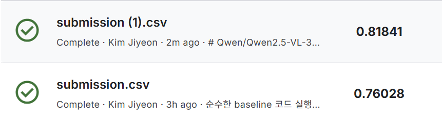
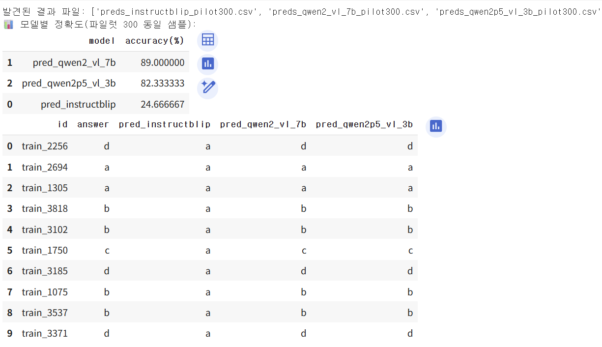
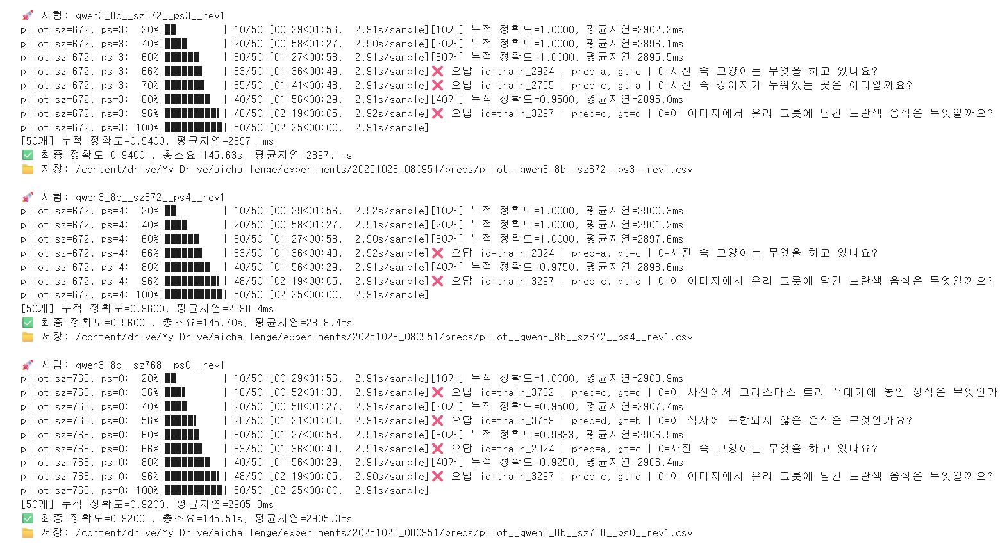
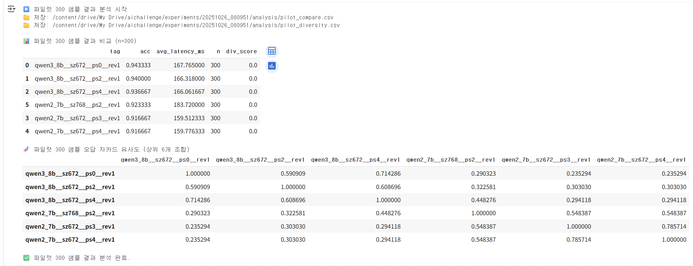
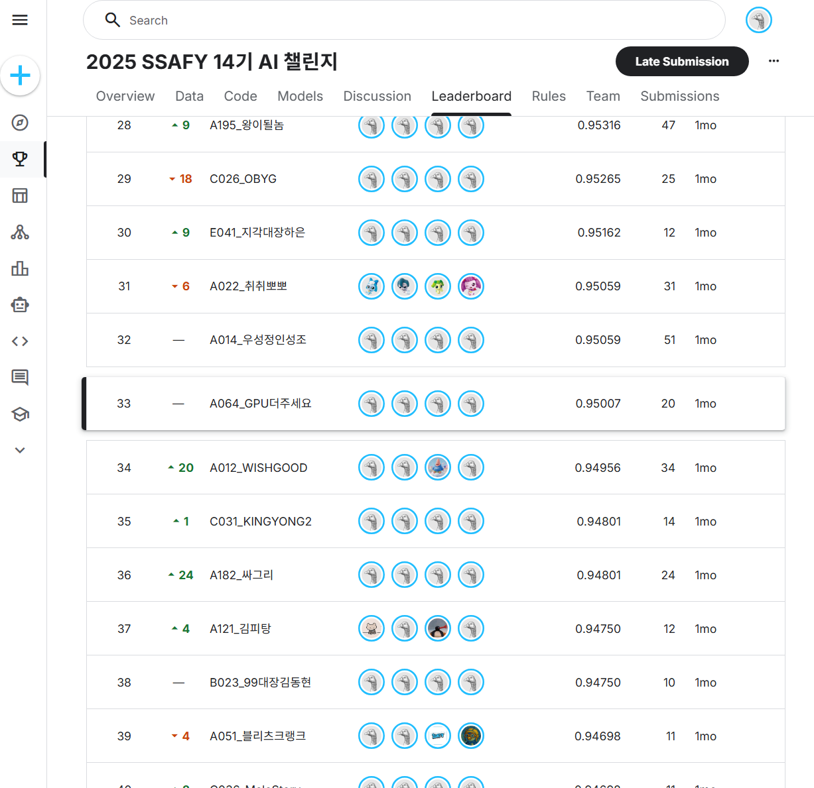

# 🏆 SSAFY 14th VQA Challenge

> **Optimizing VQA Inference Pipeline using Large Multi-modal Models**  
> **Final Result:** Rank **33 / 245 teams (Top 13%)**  
> **Public Score:** **0.95061**

---

## 📌 Project Overview

사전학습된 멀티모달 모델을 활용한 VQA 과제입니다. 짧은 대회 기간(4일)과 한정된 GPU 환경에서 **Zero-shot 모델 선정 → 프롬프트·해상도 최적화 → 전략적 앙상블**로 상위 13% 성적을 달성했습니다.

- **기간:** 2025.10.23 ~ 2025.10.27  
- **팀:** 4인  
- **역할:** Model Selection, Zero-shot Experimentation, Ensemble Design  
- **환경:** Google Colab (T4/A100), Kaggle Notebook

---

## 💡 Approach & Strategy

<details>
<summary><b>1️⃣ 가설 설정 및 검증 - Zero-shot vs Fine-tuning</b></summary>

<br>

초기 베이스라인 코드(200개 샘플 학습)를 실행한 결과 **0.76028**이라는 준수한 성능을 확인했습니다.
단 200개의 데이터만으로 이러한 결과가 나온 것은 학습의 효과라기보다, **모델이 이미 강력한 사전 지식(Pre-trained Knowledge)을 보유하고 있기 때문**이라고 판단했습니다.

이에 따라 저희 팀은 수많은 Hugging Face 모델 중 과제에 가장 적합한 모델을 선별하기 위해 다음과 같은 전략을 수립했습니다.

1. **시간 비용 절감:** 모든 후보 모델을 Fine-tuning하여 비교하는 것은 비효율적이다.
2. **순수 성능 평가:** 학습이라는 변수를 제거하고, **Zero-shot 추론**을 통해 모델 본연의 성능을 비교하는 것이 더 정확하다.

> **가설:** "베이스라인의 높은 점수는 모델의 사전 학습된 능력에서 기인한다. 따라서 Zero-shot 성능 비교만으로도 최적의 Foundation Model을 선별할 수 있다."

**검증 실험:**

| 실험 방식 | 모델 | Kaggle Score | 비고 |
|------|------|-------|------|
| Fine-tuning(200 samples) | Qwen2.5-VL-3B | 0.76028 | Baseline |
| Zero-shot | Qwen2.5-VL-3B | 0.81841 | 학습 제거 시 |




학습을 제거했을 때 오히려 성능이 **5.8% 향상**되며 가설이 입증되었습니다. 이후 복잡한 학습 파이프라인 대신 **Zero-shot 기반 모델 선별 전략**으로 전환했습니다.

</details>

<details>
<summary><b>2️⃣ Pilot300 기반 경량 실험 구조</b></summary>

<br>

전체 3,887개 데이터를 매번 사용하는 것은 시간·리소스 면에서 비효율적이었기 때문에,
**300개 무작위 샘플(Pilot300)** 을 기반으로 경량화된 평가 루틴을 설계했습니다.

- Pilot300 정확도가 실제 Kaggle 점수와 높은 상관관계를 가짐
- T4 환경에서도 3B–7B 모델까지 빠르게 비교 가능
- 후보 모델을 좁히는 데 핵심 역할
- 이후 앙상블 포함 모든 실험의 기준점으로 활용



</details>

<details>
<summary><b>3️⃣ 모델 체급 비교 및 성능 분석</b></summary>

<br>

T4 환경에서는 메모리 제약으로 인해 모델 체급을 자유롭게 확장하기 어려워, 즉시 실행 가능한 모델을 우선 선별했습니다. 이후 A100 환경 확보 후 같은 모델들을 재평가해 아래 결과를 얻었습니다.

| 모델 | 환경 | Score | 비고 |
|------|------|-------|------|
| Qwen2-VL-7B-Instruct | T4 | 0.88323 | 4bit Quantized |
| Qwen2.5-VL-7B-Instruct | T4 | 0.90483 | 4bit Quantized |
| Qwen2.5-VL-7B-Instruct | A100 | 0.92659 | bf16/float16 |
| **Qwen3-VL-8B-Instruct** | **A100 (bf16)** | **0.94804** | **Best Single Model** |

**핵심 인사이트**  
- Qwen 계열은 VQA 객관식 문제에서 일관되게 강함  
- 파라미터 증가(3B → 7B → 8B)는 정확도 향상으로 이어짐  
- A100 환경에서는 bf16로 정확도 극대화 (양자화 미사용)

</details>

<details>
<summary><b>4️⃣ 전략적 앙상블 설계</b></summary>

<br>

단일 모델 성능 향상에 한계가 있다고 판단하여, **오답 패턴이 다른 모델 조합을 만드는 것**을 목표로 전략적 앙상블을 설계했습니다.

### 4-1. 다양성 확보 전략

같은 Qwen 시리즈라도 입력 조건을 달리하면 예측 경향이 달라지는 점에 착안해, 다음 변수를 조합하여 "의도적 다양성"을 확보했습니다.

**변주 요소:**
- 프롬프트 스타일: PS0, PS2, PS3
- 입력 해상도: 384 / 512 / 672 / 768 / 896 px

실험 결과, **실제로 서로 다른 문제를 틀리는 유의미한 패턴 차이**가 관찰되었습니다.


### 4-2. 오답 패턴 분석 & 자카드 유사도

Pilot300에 대해 각 모델의 오답 리스트를 추출하고, 모델 간 오답 교집합/합집합 비율(자카드 유사도)을 계산했습니다.

- **유사도 낮음** → 서로 다른 문제를 틀림 → 앙상블 가치 높음
- **유사도 높음** → 동일 문제를 함께 틀림 → 조합 가치 없음

**선정 기준:** (1) 단일 정확도, (2) 오답 패턴 다양성



### 4-3. Voting 방식 비교

| Method | Score | 특징 |
|--------|-------|------|
| Single Best | 0.94804 | Qwen3-VL-8B |
| Hard Voting | 0.94958 | 다수결 |
| **Soft Voting** | **0.95061** | **Logit 평균 (채택)** |

Soft Voting이 모델의 과신(Overconfidence)을 억제하며 가장 안정적인 성능을 보였습니다. "1등 모델의 실수"를 "2등 모델의 확신"으로 보완하는 효과가 있었습니다.

</details>

---

## 📊 Final Result

**Public Leaderboard: Rank 33 / 245 (Top 13%)**

| Method | Kaggle Score | Improvement |
|:---|:---:|:---:|
| Baseline (Fine-tuned) | 0.76028 | - |
| Best Single (Qwen3-VL-8B-Instruct) | 0.94804 | +18.8% |
| **Final Ensemble** | **0.95007** (public) | **+19.0%** |

---

## 📝 Retrospective

<details>
<summary><b>✅ 성공 요인 (What Worked Well)</b></summary>

<br>

- **가설 기반 접근:** 초반에 "Fine-tuning보다 Zero-shot"이라는 명확한 가설을 세우고 검증한 것이 프로젝트 방향성을 결정했습니다. 덕분에 한정된 시간 내에 리소스를 효율적으로 집중할 수 있었습니다.

- **Pilot300 실험 설계:** 전체 데이터셋 대신 300개 샘플로 경량화된 평가 루틴을 구축한 것이 핵심이었습니다. 4일이라는 짧은 기간 내에 다양한 모델 조합을 빠르게 비교할 수 있었습니다.

- **자카드 유사도 기반 앙상블 설계:** "좋은 모델을 섞자"는 막연한 접근이 아닌, 자카드 유사도로 오답 패턴을 수치화하고 상호보완적인 조합만 선별했습니다. 소폭이지만 재현 가능한 성능 향상을 달성했습니다.

</details>

<details>
<summary><b>🔍 한계점 및 개선 방향 (Limitations & Future Work)</b></summary>

<br>

- **Fine-tuning 최적화 실패:** Fine-tuning을 시도했으나 하이퍼파라미터 튜닝과 데이터 전처리에 충분한 시간을 투자하지 못했습니다. Learning rate, LoRA rank, batch size 등의 조합을 체계적으로 탐색했다면 Zero-shot을 넘어서는 성능을 낼 수 있었을 것입니다. 특히 상위 모델(Qwen3-VL-8B)에 적절한 Fine-tuning을 적용했다면 단일 모델만으로도 0.95를 넘을 가능성이 있었습니다.

- **모델 다양성 부족:** Qwen 계열에만 의존한 것이 앙상블의 한계였습니다. LLaVA, Blip 등 아키텍처가 다른 모델도 프롬프트 최적화와 Fine-tuning으로 성능을 끌어올렸다면, 오답 패턴의 차별화가 극대화되어 앙상블 효과가 훨씬 컸을 것입니다.

- **프롬프트 체계화 부족:** PS0, PS2, PS3 등 여러 스타일을 시도했지만, 각 프롬프트의 단독 효과를 검증하지 못했습니다. "어떤 프롬프트가 우리 과제에 강한가"를 실험으로 검증했다면, 프롬프트 엔지니어링만으로도 성능을 개선할 수 있었을 것입니다.

</details>


---

## 📂 Directory Structure
```
추가 예정
```

---

## ⚠️ Data Disclaimer

본 프로젝트에서 사용된 VQA 데이터는 SSAFY 교육 전용으로 외부 공유가 제한됩니다.
따라서 본 저장소에는 데이터·정답 CSV·원본 이미지가 포함되지 않습니다.
코드 예시는 구조 설명을 위한 것이며, 재현 가능한 실행을 목적으로 하지 않습니다.